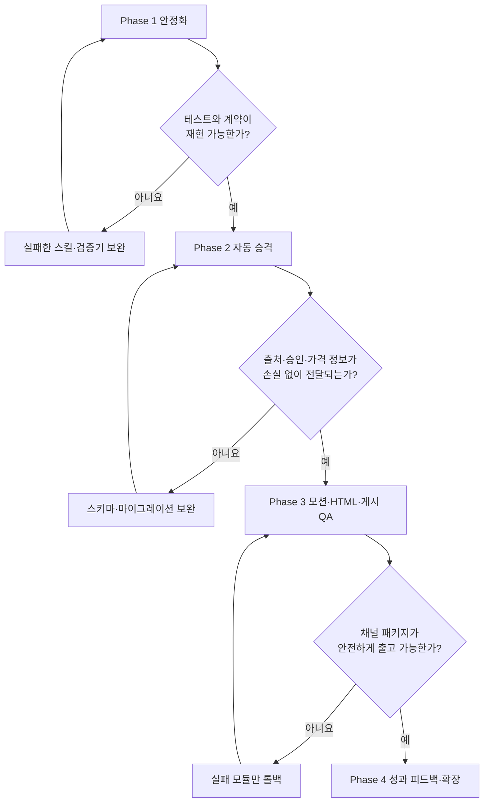

# 쿠팡 커머스 자동화 플러그인 로드맵

- 기준일: 2026-07-16
- 현재 버전: `coupang-commerce-automation` v0.1.0
- 현재 위치: **Phase 1 — 동일상품 우선 재소싱, 조건부 마진 2건 가격 검토**

> 문서 탐색: [현재 상태](../STATUS.md) · [README](README.md) · [PRD](PRD.md) · [ADR](ADR.md) · [구현 계획](COUPANG-COMMERCE-AUTOMATION-PLUGIN-PLAN.md)

## 한눈에 보는 여정


```text
출발 ───── 🚗💨 ───── 🛣️ ───── 🛣️ ───── 🏁
            지금
          Phase 1       Phase 2       Phase 3       Phase 4
```

> 자동차가 있는 **Phase 1**이 현재 위치다. 표준 40%/30% 통과는 0건이며, HDB-1 스포츠 마스크와 접이식 백팩은 상시 허용되는 35%/25% 조건부 마진 가격 검토 상태다. 실물·권리·가격 승인 전에는 상세페이지 제작으로 넘어가지 않는다.

## 2026-07-16 실제 소싱 실증

| 항목 | 결과 |
|---|---|
| 후보 풀 | 도매꾹 Best 카테고리 표본 |
| 조사 방식 | 도매꾹 Browser Use + 쿠팡 `nodriver` |
| 반복 횟수 | 3회차 |
| 전체 조사 후보 | 28개 |
| 기준 통과 | 10개, 최소 목표 5개 달성 |
| 쿠팡 근거 | 후보별 판매량순 상위 상품과 최소 5개 URL |
| 현재 상태 | `AWAITING_USER_SELECTION` |
| 이전 보고서 | [기준 통과 후보 HTML](../reports/deprecated/2026/2026-07-16/sourcing-qualified-5/qualified-candidates.html) |
| 후속 선택 상태 | `PRICE_REVIEW_BLOCKED` |
| 이전 선택 재검증 | [아이스 쿨링 스카프 결정 보고서](../reports/deprecated/2026/2026-07-16/sourcing-selection-cooling-scarf/selection-decision.html) |
| 이전 근거 계약 재계산 | [아이스 쿨링 스카프 v2 판정](../reports/deprecated/2026/2026-07-16/sourcing-recheck-cooling-scarf-v2/decision.html) |
| 이전 #8 재검증 | [국산면 고급 면스카프 판정](../reports/deprecated/2026/2026-07-16/sourcing-recheck-cotton-scarf-8/decision.html) |
| 현재 동일상품 우선 재소싱 | [조건부 마진 검토 보고서](../reports/2026/2026-07-16/resourcing-exact-identity-relaxed/report.html) |

이 실증에서 쿠팡 Browser Use 검색은 Akamai 세션 판정으로 접근이 불안정했다. 실제 Chrome을 표시하는 `nodriver`에서 홈 진입으로 세션을 준비하고 검색을 직렬 처리하는 조합을 현재 표준으로 채택했다. 이는 CAPTCHA나 로그인을 우회하는 절차가 아니며, 결과가 두 번 연속 비면 차단 상태를 저장하고 중단한다.

## 단계별 로드맵

### Phase 1. 핵심 스킬 통합 및 안정화 — 진행 중 🚗

목표: 현재 구현된 상품 소싱과 상세페이지 생성 스킬을 신뢰할 수 있는 하나의 플러그인으로 정리한다.

- [x] `coupang-commerce-automation` 플러그인 골격 및 매니페스트 구성
- [x] `coupang-product-sourcing` 스킬 포함
- [x] `coupang-detail-page-generator` 스킬 포함
- [x] 도매 후보 층화 표본화, 가격안 및 마진 평가 스크립트 구현
- [x] 기준 통과 후보 HTML 보고서와 사용자 선택 대기 흐름 구현
- [x] 도매꾹 Best 카테고리를 반복 순회해 누적 통과 5개 이상이 될 때까지 확장
- [x] 도매꾹 Browser Use 수집과 쿠팡 `nodriver` 판매량순 상위 10개 수집 조합 실증
- [x] 3회차·28개 조사에서 기준 통과 10개 HTML 보고서 생성
- [x] 일반 로켓 상위 10개 중 3개 이하 허용, 판매자로켓 허용 규칙 반영
- [x] 제품 사실·정체성 잠금과 8단계 상세페이지 게이트 정의
- [x] 10장 상세페이지 계획·생성 지원과 OCR·제품 동일성·광고 표현 QA 구현
- [x] 워크플로 5.3 상품기획·콘텐츠기획 산출물 분리와 사용자 승인 해시 게이트 구현
- [x] 이미지·GIF·영상 외부 자산 + 네이티브 HTML 하이브리드 조립기 구현
- [x] 소재별 자동·육안 QA와 조립 후 통합 QA 계약·회귀 테스트 6개 구현
- [x] 1차 간이검증→판매 신호 게이트→2차 심화검증의 2단계 운영 결정 문서화
- [x] 2차 진입 기준을 캠페인 시작 후 14일 이내 판매 2개 이상·ROAS 400% 이상의 `AND` 조건으로 확정
- [ ] `phase_1`·`phase_2` 검증 상태, 미검증 주장 차단과 재승인 계약 구현
- [x] PRD, ADR, ROADMAP 문서화
- [x] 플러그인 매니페스트 검증 통과
- [x] 소싱 단위 테스트 26개 통과
- [x] `docs/` 기준 문서 파일명과 링크 정리
- [x] 루트·단계별 `AGENTS.md` 라우팅 구성
- [x] 단계별 TDD 실행기와 Codex `PreToolUse`·`PostToolUse`·`Stop` 훅 구성
- [x] Git pre-commit 보조 게이트와 하니스 회귀 테스트 추가
- [x] 날짜별 현재 보고서 1개를 유지하고 이전 실행을 `reports/deprecated/`로 자동 보관
- [ ] 상세페이지 대표 샘플 회귀 테스트 고정
- [ ] 두 스킬을 잇는 통합 테스트 추가
- [ ] 소싱 결과와 상세페이지 입력의 필드 매핑 명세 확정
- [x] 사용자가 아이스 쿨링 스카프를 재검증 후보로 선택
- [x] 공급처 MOQ·구매단위·배송비와 쿠팡 할인 후 현재 실판매가 검증 계약 구현
- [x] 아이스 쿨링 스카프 2개입·3개입 경제성 재계산 및 현재 공급 오퍼 탈락
- [x] #8 국산면 고급 면스카프 1·2·3·5·10개 구성 재계산 및 현재 공급 오퍼 탈락
- [x] ISSUE 3회 반복 시 RULE 승격을 강제하는 하니스 구현
- [x] `SOURCING-OFFER-EVIDENCE-001` 3회 발생에 따른 `RULE.md` 강제 규칙 승격
- [x] 제품 동일성 선확정, 비동일 상품 가격의 보조 맥락화, 표준 40%/30%와 조건부 35%/25% 상시 분리 기준 반영
- [x] 61개 재선별·17개 심화 동일성 검토, 조건부 시험판매 가격 검토 2건 보고
- [ ] 대체 공급 오퍼 또는 다음 후보 재검증과 사용자 가격 승인

완료 조건:

- 플러그인 검증이 오류 없이 통과한다.
- 소싱 테스트와 상세페이지 검증 스크립트가 대표 샘플에서 재현 가능하게 통과한다.
- 사용자가 두 스킬의 현재 지원 범위와 제한을 README에서 이해할 수 있다.

### Phase 2. 공통 프로젝트 계약과 자동 승격 — 다음 목적지

목표: 사용자가 선택한 소싱 후보를 정보 손실 없이 상세페이지 프로젝트로 넘긴다.

- [ ] 버전된 `commerce-project.json` 스키마 정의
- [ ] 후보 ID, 공급처 URL, 가격안, 마진, 출처 및 승인 상태의 공통 필드 확정
- [ ] `promote_shortlist.py` 구현
- [ ] 소싱 가설을 확정 사실과 분리해 전달
- [ ] 공급처 가격 변경 시 경제성 게이트 자동 재실행
- [ ] 중단 지점 저장 및 재개 지원
- [ ] 스키마 검증과 마이그레이션 테스트 추가

완료 조건:

- 사용자가 승인한 후보 한 건을 명령 한 번으로 상세페이지 프로젝트로 승격할 수 있다.
- 원본 출처, 가격 시나리오, 승인 기록과 가설이 누락되지 않는다.
- 잘못되거나 오래된 계약은 제작 전에 차단된다.

### Phase 3. 모션·HTML·게시 전 QA

목표: 정적 상세페이지 이후의 실행 자산과 판매 채널 패키지를 완성한다.

- [ ] `commerce-motion-maker` 스킬 추가
- [ ] 3~6초 GIF 및 6~15초 짧은 영상 제작 흐름 구현
- [ ] 실촬영 필수 장면과 생성 가능 장면 자동 구분
- [ ] `commerce-html-builder` 독립 스킬 추가
- [x] 상세페이지 스킬 내부 모바일 우선 하이브리드 HTML 5.3 기반 구현
- [ ] 쿠팡용 정적 이미지와 오픈마켓용 HTML·미디어 패키지 분리
- [ ] `commerce-publish-qa` 스킬 추가
- [ ] 깨진 링크, 접근성, 파일 용량, 채널 규격 및 출처 최신성 검사
- [ ] 실패 모듈만 이전 게이트로 돌리는 롤백 구현

완료 조건:

- 동일 프로젝트 데이터에서 정적 이미지, 모션, HTML 미리보기와 채널별 패키지를 생성한다.
- 지원하지 않는 채널 기능은 안전한 정적 대안으로 자동 대체된다.
- 게시 전 QA가 실패한 자산은 최종 패키지에 포함되지 않는다.

### Phase 4. 성과 피드백과 공급처·채널 확장

목표: 실제 판매 데이터를 다음 소싱과 콘텐츠 개선에 연결한다.

- [ ] 판매량, 전환율, 반품 사유, 리뷰 및 광고 성과 입력 계약 정의
- [ ] 캠페인 ID별 사용자 성과 입력, 14일·판매 2개·ROAS 400% 판정과 정책 버전 계약 구현
- [ ] 판정 캠페인 지정과 다중 캠페인 합산 승인 계약 구현
- [ ] 1차 간이검증에서 미검증 소구와 게시 가능한 주장을 분리하는 검증기 구현
- [ ] 판매 신호 통과 SKU의 다수 샘플·별점·후기·검사서·심화 실험 결과 계약 구현
- [ ] 2차 결과가 상품기획·SOT·콘텐츠기획·QA 승인을 만료하고 재실행하도록 구현
- [ ] 가설·카피·증거 장면별 성과 회고 보고서 구현
- [ ] 낮은 성과의 원인을 가격, 상품, 증거, 카피, UI로 분리
- [ ] 다음 소싱 평가와 상세페이지 개선에 검증된 학습만 반영
- [ ] 스마트스토어·기타 오픈마켓 채널 프리셋 확장
- [ ] 중국 공급처 등 추가 공급처 어댑터 도입
- [ ] 데이터 보존 기간, 개인정보 및 계정 권한 정책 수립

완료 조건:

- 실제 성과가 후보 평가와 콘텐츠 개선에 출처와 함께 연결된다.
- 특정 상품의 사실·브랜드·성과 데이터가 다른 SKU에 섞이지 않는다.
- 신규 공급처와 채널을 핵심 파이프라인 변경 없이 어댑터로 추가할 수 있다.

## 기능 트랙별 선후관계

```mermaid
flowchart LR
    subgraph NOW["Phase 1 · 기반 안정화"]
        A[플러그인·두 스킬<br/>통합 완료]
        B["🚗 회귀 테스트·<br/>필드 매핑"]
        A --> B
    end

    subgraph CONNECT["Phase 2 · 연결"]
        C[공통 프로젝트<br/>스키마]
        D[후보 자동 승격·<br/>중단 후 재개]
        C --> D
    end

    subgraph PRODUCE["Phase 3 · 제작·출고"]
        E[모션 제작]
        F[HTML·채널<br/>패키징]
        G[게시 전 통합 QA]
        E --> F --> G
    end

    subgraph GROW["Phase 4 · 성장"]
        H[판매 성과<br/>피드백]
        I[공급처·채널<br/>어댑터 확장]
        H --> I
    end

    B --> C
    D --> E
    G --> H

    classDef done fill:#dcfce7,stroke:#16a34a,color:#14532d,stroke-width:2px;
    classDef current fill:#fef3c7,stroke:#f59e0b,color:#78350f,stroke-width:4px;
    classDef planned fill:#f3f4f6,stroke:#6b7280,color:#374151,stroke-width:2px;
    class A done;
    class B current;
    class C,D,E,F,G,H,I planned;
```



확정된 일정 추정치가 없으므로 날짜 대신 의존 관계를 표시한다. 각 단계는 앞 단계의 완료 조건과 QA 통과를 기준으로 진입한다.

## 의사결정 게이트



## 현재 스프린트 우선순위

1. HDB-1 스포츠 마스크 또는 접이식 백팩의 시험판매 검토를 계속할지 사용자 결정을 받는다.
2. 선택 후보의 실물·규격·성능 문서·이미지 사용권과 실제 로켓그로스 비용을 확인한다.
3. 경제성 통과 후보는 1차 간이 실험·최소 SKU 사실·필수 법률 정보를 확인하고 사용자 가격 승인을 받는다.
4. `handoff-shortlist.json`과 `product-plan.json`의 필드 차이를 표로 확정한다.
5. Phase 2의 `commerce-project.json` 최소 스키마와 승인·상태 전이 규칙을 구현한다.
6. 승인된 실제 SKU에서 `phase_1` 주장 상태와 5.3 하이브리드 HTML·소재 QA·통합 QA 대표 산출물을 검증한다.

## 관련 문서

- [제품 요구사항](PRD.md)
- [현재 상태](../STATUS.md)
- [아키텍처 결정 기록](ADR.md)
- [문서 안내](README.md)
- [전체 구현 계획](COUPANG-COMMERCE-AUTOMATION-PLUGIN-PLAN.md)
- [소싱 프로세스](SOURCING-PROCESS.md)
- [소싱 실행 가이드](SOURCING-EXECUTION-GUIDE.md)
